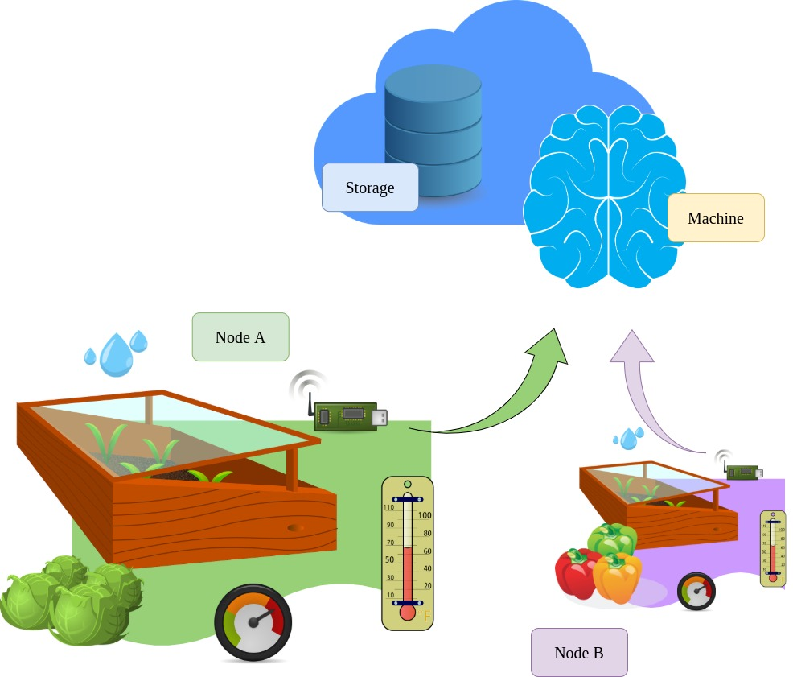

Freegrow
========

Freegrow is an opensource controller for hand-made greenhouses.

The idea behind freegrow is to create an open project of a DIY greenhouse based on low-cost materials, motors and sensors controlled by a single microprocessor (e.g Raspberry Pi).

## DIY Greenhouse Manuals

The following links describe how to build your own physical machine. They have a list of materials, motors, sensors, lights, and the steps to make everything work together. Although this project is supposed to be high-adaptable, some controllers were created to work for specific models/structures, and may not work for some weird use-cases.

* [Physical structure](docs/PHYSICAL_STRUCTURE.md)
* [Hardware Schema](docs/HARDWARE_SCHEMA.md)

## System Overview

Freegrow is a distributed system based on three main parts, the `storage`, the `machine`, and one or more `nodes`. These three pieces together create a fault-tolerant and customizable system which is basically an events manager that controls the whole process of planting something, activating and deactivating valves, lights, and motors based on sensors data, and some simple configuration manifests.



### Storage

Freegrow uses an Etcd cluster to store all resources. From the storage perspective, each resource is a simple JSON-structured manifest that contains the state of each object managed by freegrow. Only the `machine` can manage these objects, and the Etcd is the only source of truth. In order to protect your configurations from data-loss, it's recommended an HA setup for the Etcd cluster.

### Machine

Machine is the brain of Freegrow, it manages all resources, controls the nodes, and exposes a REST API for resource management. It talks directly to the storage, and doesn't have to be shipped within the microprocessor board. You can deploy both Etcd and Machine on any cloud you want and expose its API through a load balancer. The advantage of this approach is that you can check the status of your machine wherever you want, without a complex no-ip/dynamic DNS solution if you don't have a static public IP cofigured for your house.

### Node

Node is where the hardwork is done. Each node checks every minute through the Machine API the list of resources that matches its tags. Each resource is processed and executed by a separated routine, which is responsible for handling all the resource's events.

### Resource

A resource can ba an irrigator, or a group of lamps, or a cooler. Freegrow supports some few items necessary for planting almost everything, they're curretly being developed and may change a lot in the future.

#### Irrigator

Irrigator is the resource that manages a single microprocessor port which is plugged in a relay that controls a water valve. It accepts two kind of events, `on` and `off`, for which you can define the schedule cron depending on the characteristcs of your plants.

```json
{
    "kind": "irrigator",
    "metadata": {
        "name": "default",
        "tags": {
            "plant": "tomatoe",
            "greenhouseVersion": "v0.0.1"
        }
    },
    "spec": {
        "enabled": true,
        "port": 14,
        "states": [
            {
                "name": "on",
                "schedule": "5 9 * * *"
            },
            {
                "name": "off",
                "schedule": "10 9 * * *"
            }
        ]
    }
}
```

## Install

#### Requirements

- Go >= 1.14
- Make
- Docker
- Docker Compose
- Curl

### Running using docker

For the first time, you may use docker to create your environment instead of configuring by yourself an Etcd cluster, buiding the source, and so on. If you just want to give it a try, the simplest way to run Freegrow is using our development `docker-compose.yml` file.

```bash
# clone this repository
git clone https://github.com/luanguimaraesla/freegrow.git

# enter the project directory
cd freegrow

# run docker compose
sudo docker-compose up --build
```

Freegrow relies on simple manifests to configure its internal resources, for which we have to define some custom settings in order to specify their behavior. For example, let's create an Irrigator resource using the file `examples/irrigator.json`.

```bash
curl -X POST \
  -H "Content-Type: application/json" \
  -d @examples/irrigator.json \
  http://localhost:3000/resources/irrigator
```

This manifest is prepared with tags that match node tags defined in `example/node.yaml`. If you're not running using the provided docker-compose, make sure your tags are correct.

### Building and Installing 

To install freegrow you can build it from scratch or just use the available docker images `luanguimaraesla/freegrow:latest`. To build from source, just clone this repository and run make:

```bash
# clone this repository
git clone https://github.com/luanguimaraesla/freegrow.git

# enter the project directory
cd freegrow

# download dependencies, build and install the golang program
make

# test if freegrow is working for you
freegrow version
```

#### Deploy an etcd cluster

Just for ease, you can use the following [Etcd HA docker setup](https://github.com/guessi/docker-compose-etcd/blob/master/docker-compose.yml)

#### Create the Machine

To create the Machine, edit the `examples/machine.yaml` to match yours Etcd endpoints, and run `freegrow` command.

```bash
freegrow start machine -f examples/machine.yaml
```

#### Create the Node

To create the Node, edit the `examples/node.yaml` with the address of your machine instance, and run `freegrow` command.

```bash
freegrow start node -f examples/node.yaml
```

Freegrow node manifest supports some different board configurations. At this moment, we have two different backends `fakeboard` and `raspberry`.

##### FakeBoard

In order to run development tests and some proof of concepts, we created the FakeBoard controller, which mocks GPIO enabling you to run the whole system inside your machine.

```yaml
board: "fakeboard"
```

##### Raspberry Pi 3 B

We support the Raspberry Pi 3 board, but it's suppose to run with some other RPi models.

```yaml
board: "raspberry"
```
